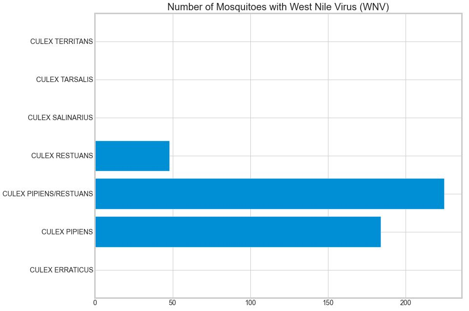
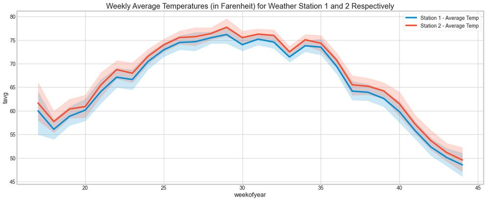
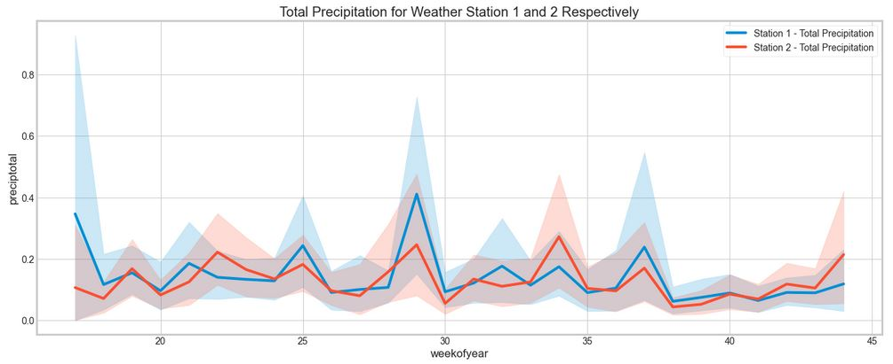
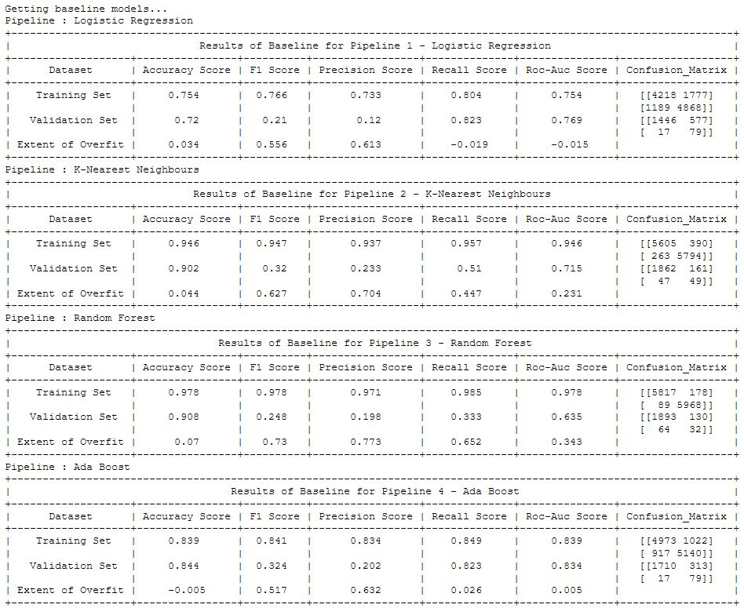
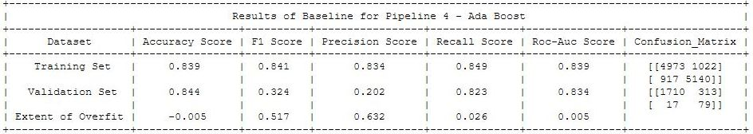

# Predicting West Nile Virus

## Problem Statement
This is binary classification problem to determine <b>when</b> and <b>where</b> in Chicago is the West Nile Virus(WNV) expected to be present.

## Introduction
We are a data scientist team of the Chicago Department of Public Health (CDPH) and have been tasked to assist in efforts to curb the spread of the West Nile Virus (WNV). Based on historical weather data and trap location data, along with detection of WNV for each testing done, we are to predict whether WNV will be present in a location. In building a model that predicts this binary class (ie WNV presence or not), we are to consider costs of misclassification (ie. predicting that WNV is present when it actually is not or predicting that WNV is not present when it actually is).

In evaluation of our model, we look to the confusion matrix which shows the precision and recall trade-off, with priority given to recall. On top of this, we also refer to the ROC-AUC score to measure how good our model is in classifying between WNV presence or not.

#### The Team
Jordan Nalpon, Zawanah Sainuddin, Stephen Chan

From General Assembly Data Science Immersive (DSI 19), Singapore

## Executive Summary
The objective of this project is to identify areas where WNV is present and subsequently allow for targeted efforts to curb the spread of WNV. 

### Analysis and Findings

<u>Exploratory Data Analysis</u>

We performed data cleaning on all the datasets - train, test, spray and weather in these notebooks:

1. [<ins>Data cleaning on train and test set</ins>](code/01-data-cleaning-train-and-test.ipynb)
2. [<ins>Data cleaning on spray and weather set</ins>](code/01-data-cleaning-spray-and-weather.ipynb)

As part of our [<ins>data exploration</ins>](code/03-eda), we observed that only certain *Culex* mosquitoes species are carriers of the WNV (Figure 1). This is considered in our model by grouping all non-carriers together, which each of these species are considered as individual features of the model.

*Figure 1: West Nile Virus carriers only in certain species of Culex Msquitoes*

There are two sets of weather data coming from two separate weather stations. When we look at weather-related factors that contribute to an optimal environment for the breeding of *Culex* mosquitoes, we find that dry weather (or humidity) provdes a good breeding environment for mosquitoes. From this, we look to the temperature and precipitation to determine if there are any significant differences between the two weather stations. From figures 2 and 3, we note no significant differences and so we defer to the nearest station for the weather data of the respective trap locations. 

*Figure 2: Temperatures over a year for both station 1 and station 2 respectively*

*Figure 3: Total precipitation over a year for both station 1 and station 2 respectively*

<u>Feature Engineering</u>

We engineered several features listed below :
1. Create a grid map over the location of the traps and sprays, which indicates relative distances
2. Obtain the spatial closeness to trap locations with the higher occurrence of WNV. 
3. Compute darkhours (since *Culex* mosquitoes are more active at night, therefore higher risk of spreading of WNV) based on sunrise and sunset data
4. Compute relative humidity based on average temperature and dewpoint (since *Culex* mosquitoes thrive in dry conditions)
5. Rolling average of weather conditions (7-day and 10-day as it takes 7-10 days for an egg to develop into an adult *Culex* mosquito (CDC, 2020)
3. Select most important features using sklearn's chi2 library

[<u><ins>Modelling</ins></u>](code/01-modelling-and-tuning.ipynb)

There is a highly imbalance class of WNV presence (94% of the dataset had no WNV present). To deal with this imbalance, we apply an oversampling techniquecalled Adaptive Synthetic (ADASYN) to balance the class. With ADASYN, new samples are synthesized from the minority class, as opposed to merely duplicating the minority samples (Bhattacharyya, 2018). 

Once features were selected, we fit the data into the following models to decide on a baseline score. 

*Figure 4: Baseline model scores*

In selecting the best performing model, there are several metrics to consider in a binary classification problem such as this, which is to tell us whether a particular testing site will have WNV or not. 

**Evaluation Strategy** 

In considering the metrics to evaluate the model, we first look at the types of prediction error we can get (Type 1 error or Type 2 error). 

<u>Type 1 error</u>

This error is the false positive rate (FPR) which is the fraction of false alerts based on model predictions. In relation to the current problem, it would be the model predicting that WNV is present when it actually is not. 

Let's consider the implications of this. From the government's perspective, should there in fact not be a WNV present and spraying efforts were made, it would be an inefficient use of resources. Also, if say people are made aware that their living area indicated presence of WNV, they may purchase mosquito repellants when they don't actually need to. 

<u>Type 2 Error</u>

This error is the false negative rate (FNR) which is the fraction of missed detection based on model predictions. In other words, it would be the model predicting that WNV is not present when it actually is. 

This may breed complacency (pun intended) among residents of the area, whereby they don't find the need to buy mosquito repellants or take any precautions. Should there be a resident in the area diagnosed with WNV, coupled with complacency of residents of the area, this may potentially lead to a WNV epidemic. For the government's perspective, healthcare costs would rise due to this.

From the above two types of error, Type 2 error is more dire than Type 1 error, from a cost perspective. Due to this, our model should seek to minimize false negatives as much as possible, more so than attempting to reduce false positives. 

**Scoring Metrics**

The balance between false positive rates and false negative rates can be seen in the precision-recall trade-off. 

Precision evaluates how precise the model is in predicting positive labels (in this case, WNV presence) and is a good evaluation metric to use when the cost of false positive is higher than the cost of a false negative (Erika, 2019). 

Recall calculates the percentage of actual positives a model correctly identified (ie. true positives) and is a good evaluation metric for when the cost of false negative is higher than that for false positives, which is in our case. 

While recall is more important than precision in our case, we cannot completely neglect precision due to the unnecessary government spending for false positive cases. So recall is more important than precision but not negligible. To assess recall and precision score, we will use the <u>confusion matrix</u> in evaluating our models.

On top of that, we will also assess our model using the <u>ROC-AUC curve</u>. The ROC-AUC curve visualises the trade off between the true-positive rate (TPR) and false-positive rate (FPR) (Czakon, 2019). The better the model, the higher the TPR and the lower the FPR. To evaluate the model in numbers, we find the <u>Area Under Curve (AUC) score</u>. AUC score of 1 means a perfect classification and ideally we want a score closer to 1. This is the scoring metric used in kaggle as well. 

On tuning the hyperparameters of the AdaBoost model, we note that the baseline model performed the best. 

*Figure 5: AdaBoost scores*

Based on this model, we note the following based on the scores: 

<u>Precision (TP/(TP+FP))</u>

Our model can predict WNV presence correctly 90.1% of the time, where  9.9% of positive predictions are false positives (ie. predicting that WNV is present when it actually is not). While we want to minimize false positives due to the costs incurred for spraying efforts, we want to prioritise minimising false negatives, which can be seen in the recall. 

<u>Recall (TP/(TP+FN)) or True Positive Rate (TPR)</u>

Our model is able to predict actual positives 92% of the time, where the 8% of predictions are false negatives (ie. predicting that WNV is not present when it actually is). Our model did well in minimizing false negatives more than false positives. 

<u>ROC-AUC score</u>

The trade-off betwen the true-positive rate and the false-positive rate (ie. probability of false alarm) is visualised in the ROC-AUC curve below, which shows that 91% of the time, the model is able to classify correctly the presence of WNVV or not. 

### Cost-Benefit Analysis

With a model that can predict whether WNV is present or not in a location, the next question would be whether to spray the location or not. This is the trade-off between false negative (ie. model predicting that WNV not present when it acually is)and false positive (ie. model predicting that WNV is present when it actually is not).

**Decision not to spray**

If the former were the case, it might be costly on the :

1. Economy 

If WNV was detected, it might be too late, as there might already be many others infected, as it takes time for symptoms to show. If say this turns into an outbreak, businesses would be forced to shutdown and people may be asked ot stay indoors. This would therefore affect the country's economy and productivity, which is very costly. 

2. Healthcare Industry

If there were to be a WNV outbreak, people would be infected, and so healthcare costs would rise. A study has shown that WNV is associated with increased healthcare resource utlisation across all phases of care(Shing, 2019).

**Decision to spray**

On the other hand, if it were the latter (ie. false positives), the cost would be the spraying efforts made would not have been worth the money since it was sprayed at an area where WNV is not present. 

**Conclusion**

Between both cases, it is pretty clear that the former is more dire than the latter. Furthermore, a study has shown that WNV disease in Sacramento County cost ~$2.28M for medical treatment and patients' productivity loss for both West Nile Virus related healthcare costs. Vector control costs ~$701K including spray procedures and overtime hours (Barber, Schleier,Peterson, 2005). It would be wise to incur the relatively smaller cost of spraying to avoid the larger cost that comes without spraying.  

### Recommendations

Multi-pronged approach involving various stakeholders in the community:

1. Preventive measures

Residents to keep house clean of stagnant water to avoid breeding of mosquitoes. Government to have campaigns which raise awareness of WNV and to educate the society on measures to take to prevent this outbreak. The Government should also be proactive in alerting the society of any clusters nearby so residents can avoid the area and prevent any potential outbreak. Healthcare professionals could work on a vaccine to prevent future outbreaks.

2. Detective measures 

Residents to immediately consult a doctor should he/she exhibit symptoms of WNV (eg. high fever, headache, convulsions, muscle weakness etc). The Government should be consistent in spraying efforts for areas expected to have WNV and has had a history of WNV. 

### Going Forward

With more data available on the WNV, a better model could be build to more accurately identify areas with higher risk of WNV. With more spraying efforts as well, there could be more data to work with to measure the effectiveness of the spray. 

## Data Dictionary

Below the data description for datasets provided. For more details of the data, kindly refer to [this link](https://www.kaggle.com/c/predict-west-nile-virus/data)

The training set consists of data from 2007, 2009, 2011, and 2013, while the test set comprise data for 2008, 2010, 2012, and 2014.

|Feature |	Type  |	Dataset | Description |
| :----: | :----: | :----: | :------ |
|Id |	int |	train.csv/test.csv |	ID number of the record|
|Date |	datetime |	train.csv/test.csv |	date the WNV test is performed|
|Address |	datetime 	|train.csv/test.csv |	approximate trap address; sent to GeoCoder |
|Species |	str |	train.csv/test.csv 	|mosquito species in trap|
|Block 	|str |	train.csv/test.csv |	block number of address|
|Street |	str |	train.csv/test.csv |	street of address|
|Trap |	str |	train.csv/test.csv |	ID number of the trap|
|AddressNumberAndStreet |	str |	train.csv/test.csv |	approximate address retrieved from GeoCoder|
|Latitude |	float |	train.csv/test.csv |	latitude retrieved from GeoCoder|
|Longitude |	float 	|train.csv/test.csv |	longitude retrieved from GeoCoder|
|AddressAccuracy |	int |	train.csv/test.csv |	accuracy of information returned from GeoCoder|
|NumMosquitos |	int |	train.csv/test.csv |	number of mosquitoes in a sample|
|WnvPresent |	int |	train.csv/test.csv 	|whether or not WNV is present in a sample (1 = present; 0 = absent)|
|Date |	datetime 	|spray.csv |	date of spray|
|Time |	datetime |	spray.csv |	time of spray|
|Latitude |	float |	spray.csv |	latitude of spray|
|Longitude |	float |	spray.csv |	longitude of spray|
|Station 	|int |	weather.csv |	weather station (1 or 2)|
|Date| 	datetime |	weather.csv |	date of measurement|
|Tmax |	int |	weather.csv |	maximum daily temperature (F)|
|Tmin |	int |	weather.csv |	minimum daily temperature (F)|
|Tavg |	int |	weather.csv |	average daily temperature (F)|
|Depart 	|int |	weather.csv |	departure from normal temperature (F)|
|Dewpoint |	int |	weather.csv |	average dewpoint (F)|
|WetBulb |	int |	weather.csv 	|average wet bulb|
|Heat |	int 	|weather.csv |	heating degree days|
|Cool |	int |	weather.csv |	cooling degree days|
|Sunrise |	int |	weather.csv |	time of sunrise (calculated)|
|Sunset |	int |	weather.csv |	time of sunset (calculated)|
|CodeSum |	str |	weather.csv |	code of weather phenomena|
|Depth |	int |	weather.csv |	unknown|
|Water1 |	int |	weather.csv |	unknown|
|SnowFall |	int |	weather.csv 	|snowfall (inch)|
|PrecipTotal 	|str |	intweather.csv |	total daily rainfall (inch)|
|StnPressure |	int |	weather.csv |	average atmospheric pressure (inch Hg)|
|SeaLevel |	int |	weather.csv |	average sea level pressure (inch Hg)|
|ResultSpeed 	|float |	weather.csv |	resultant wind speed (mph)|
|ResultDir 	|int |	weather.csv |	resultant wind direction (degrees)|
|AvgSpeed |	int |	weather.csv |	average wind speed (mph)|

### References

"Life stages of Culex pipiens, Cx. quinquefasciatus, and Cx. tarsalis" (CDC, 2020)
https://www.cdc.gov/mosquitoes/about/life-cycles/culex.html

"SMOTE and ADASYN (Handling Imbalanced Data Set)" (Bhattacharyya, 2018)
https://medium.com/coinmonks/smote-and-adasyn-handling-imbalanced-data-set-34f5223e167

Economic Cost Analysis of West Nile Viurs Outbreak (Barber, Schleier,Peterson, 2005)
https://www.ncbi.nlm.nih.gov/pmc/articles/PMC3322011/

The direct healthcare costs attributable to West Nile virus illness in Ontario, Canada: a population-based cohort study using laboratory and health administrative data (Shing,2019)
https://bmcinfectdis.biomedcentral.com/articles/10.1186/s12879-019-4596-9

## Folder Organization

    |__ code
    |   |__ 01-data-cleaning-train-and-test.ipynb   
    |   |__ 02-data-cleaning-spray-and-weather.ipynb
    |   |__ 03-eda.ipynb
    |   |__ 04-modelling-and-tuning.ipynb  
    |   |__ train.html  
    |   |__ test.html
    |   |__ weather.html       
    |__ data
    |   |__ 1_raw
    |   |   |__ train.csv
    |   |   |__ test.csv
    |   |   |__ weather.csv
    |   |   |__ spray.csv
    |   |__ 2_clean
    |   |   |__ train.csv
    |   |   |__ test.csv
    |   |   |__ weather.csv
    |   |   |__ spray.csv
    |   |__ 3__kaggle-submissions
    |   |   |__ kaggle_submissions.csv
    |__ images
    |   |__ wnv-carriers.jpg
    |   |__ temp-stn1-stn2.jpg
    |   |__ rain-stn1-stn2.jpg
    |   |__ baseline-model.jpg
    |   |__ ada-base.jpg
    |__ project_management
    |   |__ P4-project-management.xlsx
    |__ presentation_slides
    |   |__ P4-SZJ-presentation.pdf
    |__ README.md

